# Practicket (프랙티켓)

> 실제 예매처의 대기열·좌석 선택·보안문자를 재현한 티켓팅 연습 플랫폼
> 반복 연습으로 예매 성공률을 높이고, 기록을 랭킹으로 비교합니다.

[practicket.com](https://practicket.com/)

<br/>

## Service Metrics

운영 중인 실서비스로, 티켓팅 시즌마다 실사용자가 유입됩니다. *(Google Analytics 기준, 2026)*

| 지표 | 수치 |
|------|------|
| 누적 사용자 (2026) | 150,000+ |
| 최근 3개월 평균 MAU | 약 30,000 |
| 평균 세션 참여 시간 | 5분+ |

> 평균 세션 5분 이상은 일반 웹서비스 대비 높은 수준으로, 사용자가 실제로 몰입해 반복 연습한다는 지표입니다.

<br/>

## Key Features

| 기능 | 설명 |
|------|------|
| 실전 예매 시뮬레이션 | 예매 가능 구간 타이머 → 대기열 진입 → 실시간 순번 → 좌석 선택까지 실제 티켓팅 흐름을 그대로 재현 |
| 연습 모드 & 랭킹 | I-Ticket(신·구 UI) / M-Ticket 모드, 일간·주간·월간 랭킹으로 내 기록을 다른 사용자와 비교 |
| 보안문자 연습 | 보안문자 입력 속도를 측정하고 전체 사용자 대비 상위 %·순위로 환산 |
| 실시간 채팅 | 사용자끼리 연습 팁을 공유하는 커뮤니티 (욕설 필터·요청 제한 적용) |
| 포도아트 | 포도알 픽셀로 팬아트를 만들어 공유 (좋아요·댓글·조회수) |

### 화면

<table>
  <tr>
    <td align="center">실전 예매 시뮬레이션<br/>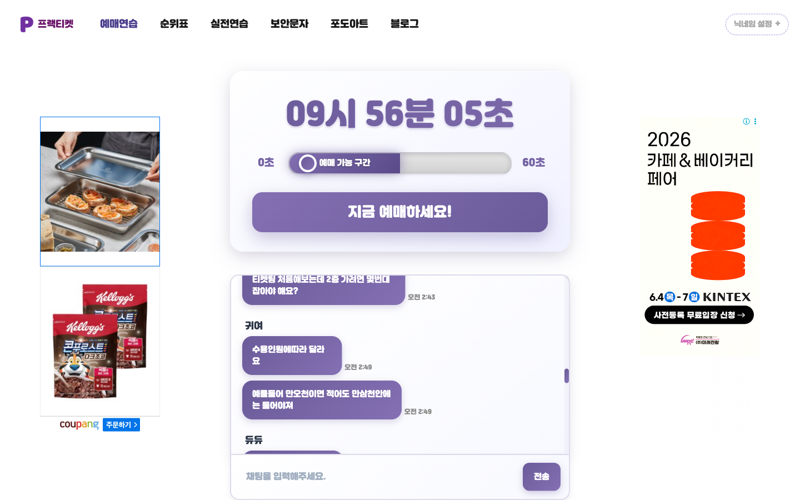</td>
    <td align="center">연습 모드 &amp; 랭킹<br/>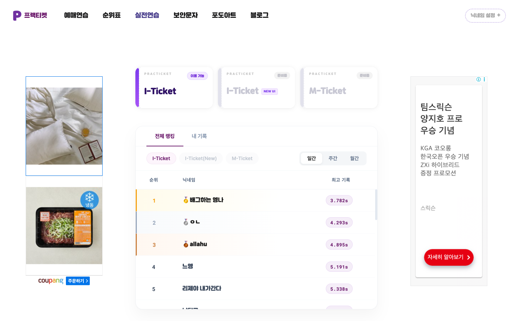</td>
  </tr>
  <tr>
    <td align="center">보안문자 연습<br/>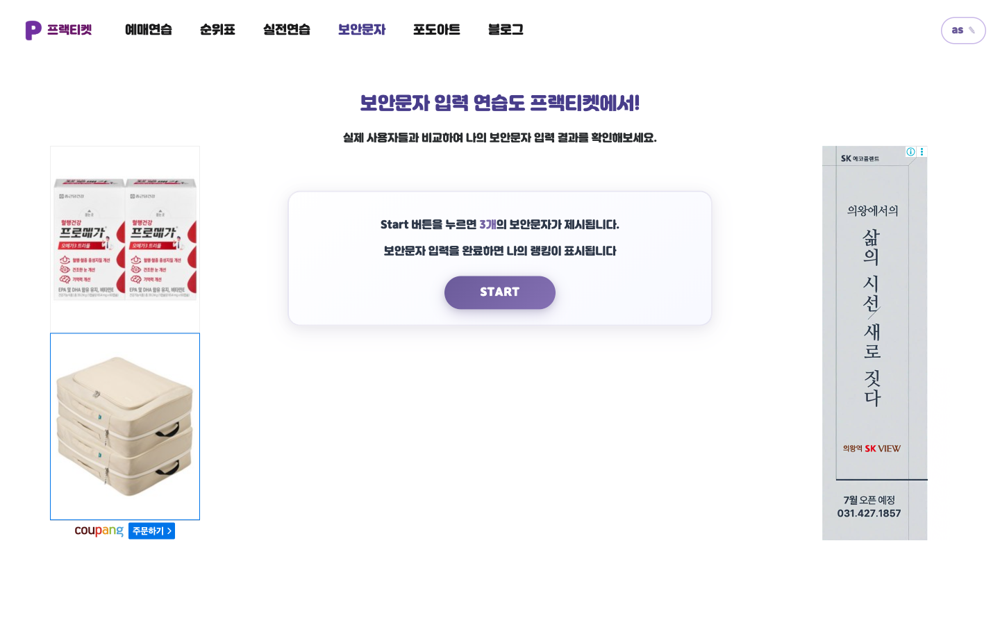</td>
    <td align="center">포도아트 갤러리<br/>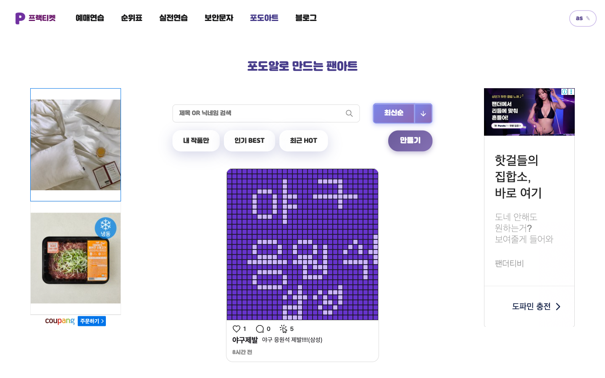</td>
  </tr>
</table>

### 반응형 (Mobile)

데스크탑과 모바일을 모두 지원합니다.

<p align="center">
  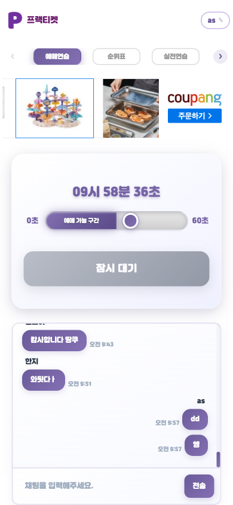
  &nbsp;
  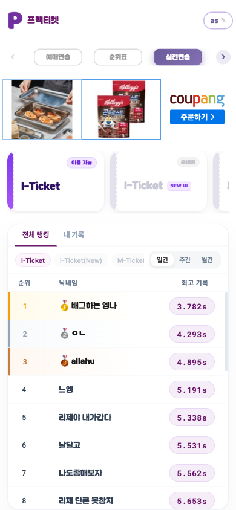
  &nbsp;
  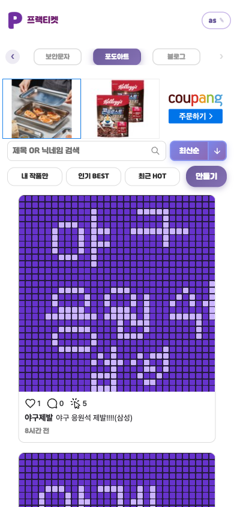
</p>

<br/>

## Tech Stack

#### Backend


#### Data


#### Infra & Ops


#### View


<br/>

## Architecture


단일 홈 서버에 Kubernetes 클러스터를 운영하며, 네임스페이스로 환경을 격리합니다.

#### 네임스페이스
- `practicket` (프로덕션) / `practicket-stage` (스테이지) — 동일 구조를 환경별로 분리
- `argocd` — GitOps 배포 컨트롤러

#### 요청 라우팅 (NGINX Reverse Proxy)
도메인 기준으로 Ingress 까지 트래픽을 분기합니다.
- `practicket.com` → `practicket` (prod)
- `stage.practicket.com` → `practicket-stage` (stage)
- `argo.practicket.com` → ArgoCD 대시보드

각 앱 네임스페이스는 `Ingress → Service` 뒤에 Spring Boot 메인 서버(Deployment), FastAPI 욕설 필터([profanity-filter](https://github.com/Jeongho0805/profanity-filter), Deployment), Redis(StatefulSet)로 구성됩니다. 데이터 저장소(MySQL·MongoDB)와 모니터링(Prometheus node_exporter·Grafana)은 클러스터 외부 호스트에서 운영합니다.

#### 배포 (GitOps)
개발자 push → App repo → CI 가 이미지 빌드 후 Docker Hub push + Deploy repo 이미지 태그 갱신 → ArgoCD 가 Deploy repo 를 폴링해 두 네임스페이스로 자동 동기화.

#### 런타임 구성
- Spring MVC 서버, 실시간 통신은 SSE(SseEmitter)
- Redis — 예매 대기열·토큰·분산 락·채팅 Pub/Sub
- MySQL — 연습 기록·랭킹·포도아트 (JPA + QueryDSL)
- MongoDB — 채팅 메시지

#### 데이터 흐름

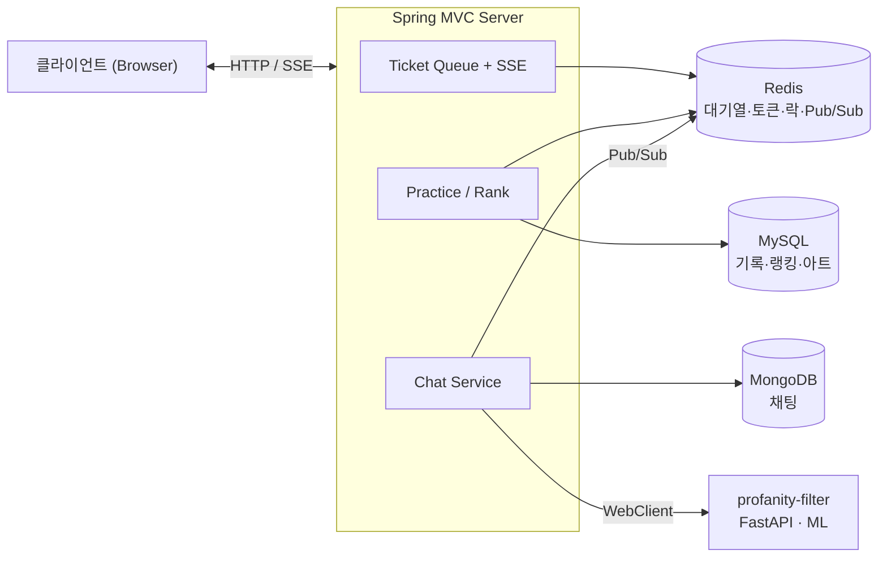

#### 실시간 예매 대기열 흐름

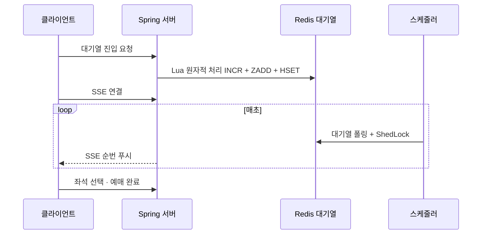

<br/>

## Engineering Highlights

실서비스 트래픽을 견디기 위해 고민한 핵심 구현입니다.

#### 1. 원자적 대기열 처리 — Redis + Lua Script
순번 채번(`INCR`)·대기열 삽입(`ZADD`)·초기 순번 저장(`HSET`)을 하나의 Lua 스크립트로 원자적으로 실행해, 동시 진입 시에도 순번 꼬임·중복 진입 없이 처리합니다.

#### 2. 실시간 순번·채팅 푸시 — SSE
대기 순번과 채팅 메시지를 SSE 로 서버 → 클라이언트 단방향 푸시합니다. 다중 인스턴스 환경에서는 Redis Pub/Sub 으로 메시지를 팬아웃해 모든 인스턴스의 연결로 전파합니다.

#### 3. 분산 환경 스케줄러 — ShedLock
여러 인스턴스가 동시에 떠 있어도 대기열 폴링·정산 같은 스케줄 작업이 단 한 번만 실행되도록 ShedLock(Redis) 으로 잠급니다.

#### 4. 현실적인 티켓팅 환경 재현 — 가상 유저 시뮬레이션
스케줄러가 가상 유저를 대기열에 주기적으로 투입하고 무작위로 예매를 발생시켜, 혼자 연습해도 실제 티켓팅처럼 경쟁·혼잡도가 있는 환경을 체감하도록 했습니다.

#### 5. 커서 기반 랭킹 페이지네이션
랭킹 무한 스크롤을 (기록, ID) 복합 커서로 구현해, 동점 처리와 페이지 누락 없이 안정적으로 페이징합니다.

#### 6. AI 욕설 필터링 — 자체 구축 ML 마이크로서비스
채팅 욕설 탐지를 위해 한국어 욕설 분류 모델을 직접 파인튜닝(HuggingFace Transformers)하고 FastAPI 로 서빙하는 별도 마이크로서비스([profanity-filter](https://github.com/Jeongho0805/profanity-filter))를 구축해, 메인 서버와 동일하게 Docker·Kubernetes 로 배포했습니다. 메인 서버는 이 모델 API 를 WebClient 로 호출하며, 호출이 실패해도 예외를 잡아 채팅은 멈추지 않도록(Graceful Degradation) 설계했습니다.

<br/>

## CI/CD

GitOps 기반 자동 배포 파이프라인.

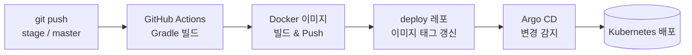

- 브랜치별 환경 분리: `stage` → 스테이지, `master` → 프로덕션
- 애플리케이션 설정은 GitHub Secrets 로 주입

<br/>

## Monitoring & Observability

운영 상태를 직접 관측할 수 있도록 로그·메트릭·에러 추적 체계를 구축했습니다.

| 영역 | 스택 |
|------|------|
| 로그 수집·조회 | Grafana + Loki |
| 서버 리소스 모니터링 | Grafana + Prometheus · node_exporter |
| 애플리케이션 에러 추적 | Sentry |

#### 서버 리소스 — Node Exporter Full
CPU·메모리·디스크·네트워크 등 호스트 자원을 실시간 모니터링합니다.

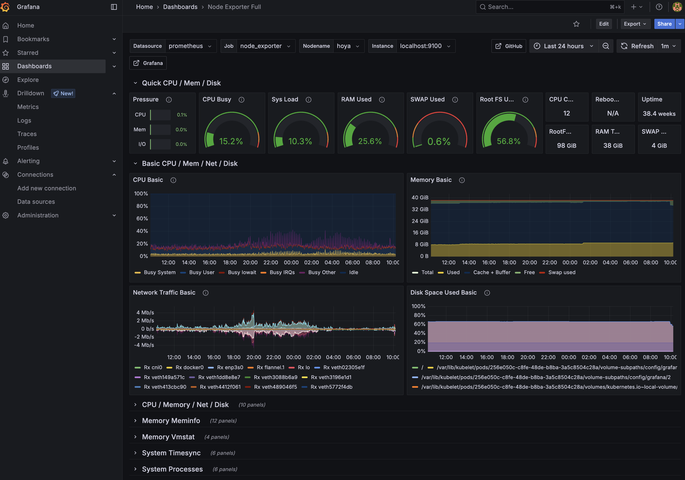

#### 로그 — Loki
애플리케이션 로그를 Loki 로 중앙 집계하고, Grafana 에서 라벨·기간별로 조회합니다.

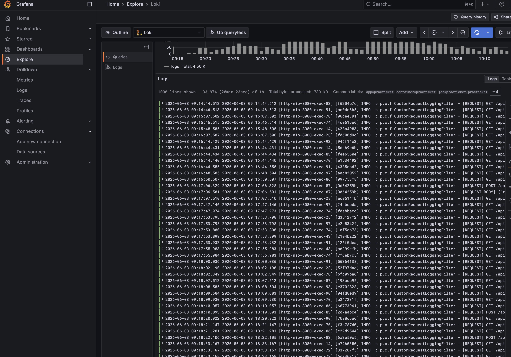

<br/>

## Project Structure

도메인 단위 패키지 구조 (`com.practicket`)

```
ticket     예매 시뮬레이션 (대기열·SSE·Lua·스케줄러)
practice   연습 모드 & 랭킹
captcha    보안문자 연습
chat       실시간 채팅 (MongoDB·Pub/Sub)
art        포도아트 갤러리
client     익명 사용자 (JWT)
```

<br/>

## Related Repositories

| 레포지토리 | 설명 |
|------------|------|
| [profanity-filter](https://github.com/Jeongho0805/profanity-filter) | 채팅 욕설 탐지 ML 마이크로서비스 — Python · FastAPI · HuggingFace Transformers (직접 파인튜닝한 모델을 서빙, Docker·K8s 배포) |
| [practicket-deploy](https://github.com/Jeongho0805/practicket-deploy) | ArgoCD GitOps 배포 레포 — Helm 차트 · HPA · prod/stage 오버레이로 Kubernetes 선언적 배포 |
